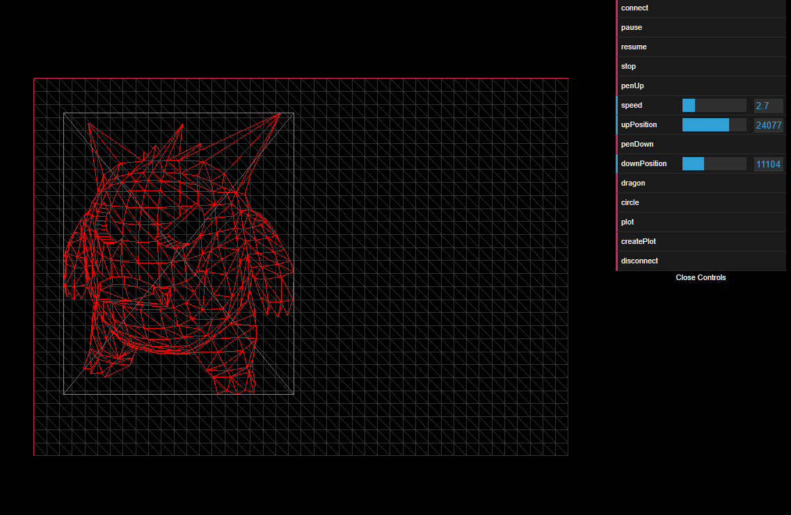

# Hephaestus

control Axidraw over Web Serial API. 

 - Render in THREE.js for performance
 - align and scale to print area
 - FIFO queue in borwser for pause/resume
 - realtime time estimate
 - basic plot optimisation
 

Bugfix:
 - Pause / resume not working
 - add search box in projects list, 
    - maybe group by date
 - fix the path length
 - scale, grab widget is misaligned, and mouse position check not working right
 - Sometimes the plot hangs -

New Feature
 - Change color of lines while printing to show progress
    Block-based optimistaion 