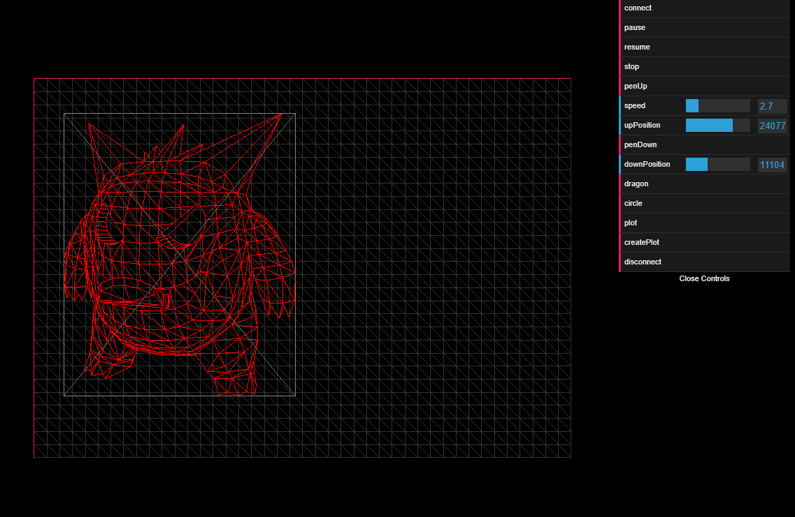

# Hephaestus

control Axidraw over Web Serial API. 
 - Drag and drop svg to the browser 
 - Render in THREE.js for performance
  - align and scale to primt area
 
Todo: 
 - plot optimisation
 - manage device FIFO queue in borwser for pause/resume
 - show realtime analytics
 - figure out units
  
